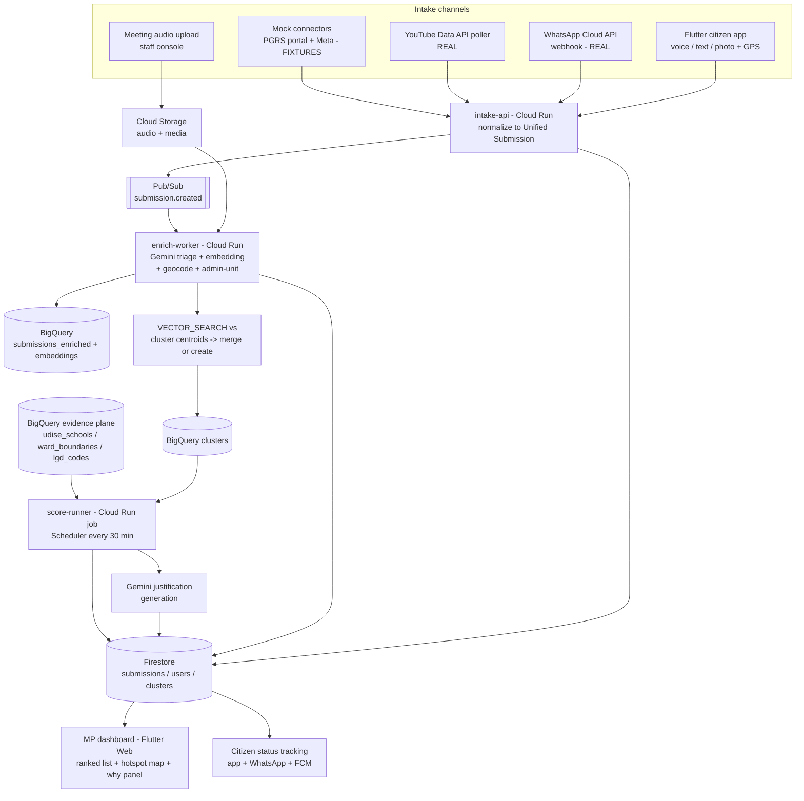

# People's Priorities — Technical Architecture

**Hackathon:** Google Cloud "Build with AI" — civic-tech track
**Team size:** 3–4 · **Base repo:** `campus-connect` (Flutter + Node.js/Express + Firebase + Gemini)
**Status:** Design v1.1 — ready to build from *(v1.1: triage model updated to `gemini-3.5-flash` after its May 2026 GA — see companion review doc §2)*

---

## 0. Plain-language summary

Citizens send development requests the way they already communicate — a voice note in Telugu on WhatsApp, a photo in an app, a comment under the MP's YouTube video, or by speaking at a public meeting whose recording gets uploaded. Every one of those, regardless of language or format, is converted by Gemini into the same structured record: *what is being asked for, what category, where*. Records asking for the same underlying thing ("we need a high school in Kondapur") are automatically recognized as one demand and merged, so a hundred voices become one tracked item with a hundred supporters — not a hundred duplicate rows.

Each merged demand is then pinned to an administrative unit (village/ward/mandal) and checked against real public data — the flagship being UDISE+ school records, so a school-upgrade request is scored against actual enrollment, school capacity, and travel distance in that exact area. Citizen demand, data-backed need, evidence quality, and recency combine into one priority score. The MP's dashboard shows a ranked list and a hotspot map, and every rank comes with a plain-English "why": *"Ranked #2: 31 citizens across 3 channels; UDISE+ shows 412 upper-primary students in this mandal with no secondary school within 5 km."*

It is campus-connect's proven triage-and-lifecycle pipeline, widened from one campus to one constituency, with three genuinely new layers: cross-language demand clustering, an evidence-grounding pipeline over BigQuery, and a composite ranking model. Everything runs on Google Cloud free tier except the seams explicitly called out. Integrations that can't legally or practically be live today (government grievance portals, Meta platforms) are built as pluggable connectors running on clearly-labeled fixture data.

---

## 1. System architecture

### 1.1 What carries over from campus-connect

| Component | Disposition | Notes |
|---|---|---|
| Flutter app shell, auth flows, submission form (photo+text) | **As-is** | Rebrand; add language picker + voice recorder |
| Node.js/Express API on Firebase/Cloud Run | **As-is** | Becomes `intake-api`; new routes only |
| Firebase Auth + role-based access (citizen/department/admin) | **Modified** | Roles remap: citizen / MP-staff / MP. "Department" routing logic is repurposed as category routing |
| Gemini multimodal triage (classify, prioritize, duplicate-flag) | **Modified** | Prompt rewritten (§3a): adds language ID, translation, canonical English restatement, location extraction. Its per-submission duplicate-flag is replaced by embedding clustering (§4) |
| Lifecycle model (submitted → assigned → in-progress → resolved) | **Modified** | Becomes cluster-level, not submission-level: acknowledged → under-review → recommended → taken-up → completed. Submissions inherit their cluster's status |
| OSM/Nominatim geocoding | **As-is + extended** | Kept as primary geocoder; new: point-in-polygon admin-unit assignment in BigQuery (§5) |
| Priority-weighted feed (priority + upvotes + recency) | **Replaced** | Superseded by the composite evidence-grounded score (§6). The feed UI pattern survives as the dashboard's ranked list |
| **Genuinely new** | — | WhatsApp connector, meeting-transcript extraction, YouTube poller, mock-connector framework, embedding clustering, BigQuery evidence plane, composite scoring, MP dashboard with map + "why" panel |

### 1.2 Two-plane design

**Firestore is the operational plane** — source of truth for submissions, clusters, users, lifecycle status; what the apps read/write in real time. **BigQuery is the analytics plane** — embeddings, vector clustering, GIS boundary joins, the UDISE+ evidence dataset, and scoring SQL. A one-way sync (Pub/Sub → worker) copies enriched submissions into BigQuery; a scheduled scoring job writes cluster scores *back* to Firestore for the dashboard. This split exists because clustering/evidence/scoring are batch-shaped joins over public datasets — BigQuery's home turf — while the app needs Firestore's realtime listeners and offline support, which campus-connect already uses.

**Rejected:** Vertex AI Vector Search — deployed index endpoints bill per node-hour 24/7 with no free tier (realistically [$400–800/month floor](https://www.cloudzero.com/blog/google-vertex-ai-pricing/)), unjustifiable when clustering is async and BigQuery `VECTOR_SEARCH` is serverless within the free query tier. Pinecone — off-GCP, disqualified by track rules and adds a vendor. Firestore native KNN vector search — viable, but it would put clustering in a different engine from evidence joins and scoring; one analytics plane beats two half-planes. PostGIS on Cloud SQL — no meaningful free tier for an always-on instance; BigQuery GIS (`ST_CONTAINS`, `ST_DISTANCE`) covers every geo operation we need.

### 1.3 Services (all Cloud Run)

- **`intake-api`** (Node/Express, evolved from campus-connect): REST for the Flutter apps; webhook receivers for WhatsApp and connector pushes; normalizes everything into the Unified Submission (§2); writes Firestore; publishes `submission.created` to Pub/Sub.
- **`enrich-worker`** (Pub/Sub push subscriber): runs Gemini triage (§3a), generates the embedding, geocodes + assigns admin unit, writes enrichment back to Firestore and inserts the row into BigQuery, then runs the cluster-assignment query (§4).
- **`connectors`** (scheduled + webhook): YouTube poller (real), mock portal/Meta fixture replayers (§8). Each implements one interface, all output Unified Submissions into `intake-api`.
- **`score-runner`** (Cloud Scheduler, every 30 min): executes scoring SQL (§6) over clusters × evidence in BigQuery, calls Gemini for "why" justifications on clusters whose score components changed (§3c), writes ranked results to Firestore `clusters` collection.

**Meeting audio path:** MP-staff console (dashboard page) uploads audio to Cloud Storage → Cloud Storage trigger → `enrich-worker` chunks it (≤15-min segments, 30 s overlap) and runs the extraction prompt (§3b) per chunk; each extracted atomic complaint enters the pipeline as an ordinary Unified Submission with `source: "meeting"`.

### 1.4 End-to-end walk-through (single citizen action → dashboard)

A farmer sends a 40-second Telugu voice note to the WhatsApp number: *"our village school only goes to 7th class, children walk 6 km to Ghatkesar for high school."*

1. Meta delivers the webhook to `intake-api`; media is fetched and stored in Cloud Storage; a Unified Submission is written (`source: whatsapp`, `citizen_hash` = HMAC of phone number) and `submission.created` published. The citizen gets an instant templated ack in Telugu (free — inside the 24 h service window).
2. `enrich-worker` sends the audio to Gemini 3.5 Flash with the triage prompt: → language `te`, transcript, `canonical_summary_en: "Upgrade the village school beyond grade 7 / provide a secondary school; children travel ~6 km to Ghatkesar"`, category `education.school_upgrade`, location mentions `["village school", "Ghatkesar"]`.
3. No GPS on WhatsApp → Nominatim geocodes "Ghatkesar" biased to the constituency bounding box; `geocode_confidence: medium`. BigQuery `ST_CONTAINS` assigns mandal + LGD village code.
4. `gemini-embedding-001` embeds the canonical English summary; `VECTOR_SEARCH` against cluster centroids (filtered to same category, same/adjacent mandal) finds an existing cluster at cosine 0.87 → auto-merge. The cluster's unique-citizen count ticks from 22 to 23.
5. At the next `score-runner` run, the cluster's demand term updates; its evidence term was already computed from UDISE+ (412 upper-primary students in the mandal, zero secondary schools within 5 km straight-line). Score moves 83.5 → 84.1; justification regenerates.
6. Dashboard (Firestore realtime listener) reorders; the "why" panel shows the demand/evidence/confidence/recency breakdown, the 23 supporting submissions (voice notes playable), and the UDISE+ figures with source citation. The farmer can check status later by messaging "status" on WhatsApp.

### 1.5 Diagram



---

## 2. Unified data schema

One Firestore collection `submissions`, one BigQuery table `pp.core.submissions_enriched` (same shape + embedding column). Every channel writes this record; source-specific detail lives in `channel_meta`, a free-form map that the common pipeline never reads — so a new channel can never break clustering, scoring, or the dashboard.

```jsonc
// Firestore: submissions/{submission_id}
{
  "submission_id": "sub_01J9XK...",        // ULID, string
  "schema_version": 1,                      // int
  "source": "whatsapp",                     // enum: app | whatsapp | meeting | youtube | portal_mock | meta_mock
  "is_simulated": false,                    // bool — TRUE for all mock-connector data; surfaces as a dashboard badge
  "created_at": "2026-07-05T09:14:00Z",    // timestamp (server)
  "occurred_at": "2026-07-05T09:13:41Z",   // timestamp — when the citizen actually spoke/posted (≠ ingest time for meetings/YouTube)

  "citizen": {
    "citizen_hash": "hmac256:9f2c...",     // HMAC-SHA256(phone|uid, server pepper). Null for anonymous meeting speakers.
    "auth_kind": "whatsapp_phone",          // enum: firebase_uid | whatsapp_phone | youtube_channel | anonymous
    "display_locale": "te"                  // for replies/notifications
  },

  "content": {
    "modality": "voice",                    // enum: text | voice | photo_text | video_comment
    "original_text": null,                  // string|null — as typed, original script
    "original_language": "te",              // BCP-47, Gemini-detected
    "media": [{ "kind": "audio", "gcs_uri": "gs://pp-media/wa/01J9.ogg", "mime": "audio/ogg", "duration_s": 40 }],
    "transcript_original": "మా ఊరి బడి 7వ తరగతి వరకే ...",   // filled by enrichment for voice/meeting
    "text_en": "Our village school only goes to grade 7; children walk 6 km to Ghatkesar for high school."  // faithful translation
  },

  "ai": {                                   // written by enrich-worker; null until enriched
    "canonical_summary_en": "Upgrade village school beyond grade 7 / provide secondary school access; ~6 km travel to Ghatkesar",
    "category": "education",                // fixed taxonomy, §3a
    "subcategory": "school_upgrade",
    "kind": "development_request",          // enum: development_request | grievance | question | other
    "urgency": "medium",                    // low | medium | high | safety_critical
    "entities": ["village school", "Ghatkesar", "grade 7"],
    "triage_confidence": 0.86,              // model self-report, 0–1
    "embedding_dim": 768,                   // embedding vector itself lives ONLY in BigQuery (Firestore doc size + cost)
    "model_versions": { "triage": "gemini-3.5-flash", "embedding": "gemini-embedding-001@768" }
  },

  "location": {
    "raw_mentions": ["Ghatkesar", "village school"],
    "point": { "lat": 17.4432, "lng": 78.6829 },   // GeoPoint; from device GPS (app) or geocoder
    "method": "nominatim_biased",           // enum: device_gps | exif | nominatim_biased | google_geocode_fallback | staff_pin | none
    "geocode_confidence": "medium",         // high (GPS/staff pin) | medium (unambiguous geocode) | low (ambiguous) | none
    "admin": {                              // assigned by ST_CONTAINS in BigQuery
      "constituency_code": "PC-MALKAJGIRI",
      "mandal_code": "TS-0417",             // block/mandal/tehsil level — always populated when point exists
      "lgd_village_code": "578231",         // rural; null in urban
      "ulb_ward_code": null                 // urban; null in rural
    }
  },

  "cluster_id": "clu_edu_00042",            // null until clustered; the ONLY join key the dashboard needs
  "cluster_assignment": { "similarity": 0.87, "decided_by": "auto", "at": "2026-07-05T09:15:02Z" },  // decided_by: auto | staff_review

  "consent": {
    "basis": "direct_submission",           // direct_submission | public_meeting_notice | public_platform
    "pii_scrubbed": true                    // triage strips names/phone numbers from text_en & summary
  },

  "channel_meta": { /* source-specific, schema-free — see per-source shapes below */ }
}
```

**`channel_meta` shapes** (preserved verbatim, never read by common pipeline):

```jsonc
// source: whatsapp
{ "wa_message_id": "wamid.HBg...", "wa_phone_hash": "hmac256:...", "profile_name": "Ravi",
  "in_service_window": true }

// source: meeting
{ "meeting_id": "mtg_2026-07-02_kushaiguda", "recording_gcs": "gs://pp-media/mtg/...",
  "chunk_index": 3, "segment_start_s": 1841.2, "segment_end_s": 1876.0,
  "speaker_label": "SPK_07",               // diarization label — NOT an identity
  "diarization_confidence": "low",         // honest field; see §12
  "verbatim_quote_original": "మా కాలనీలో ..." }

// source: youtube
{ "video_id": "dQw4...", "comment_id": "UgzXK...", "thread_id": "UgzXK...",
  "like_count": 14, "author_channel_hash": "hmac256:...", "published_at": "2026-07-01T..." }

// source: portal_mock
{ "fixture_file": "pgrs_batch_02.json", "mock_registration_no": "PGRS/2026/004417",
  "portal_department": "Panchayat Raj" }
```

**Clusters collection** (`clusters/{cluster_id}` in Firestore; mirrored in BigQuery):

```jsonc
{
  "cluster_id": "clu_edu_00042",
  "canonical_title_en": "Secondary school access — Ghatkesar mandal (upgrade or new school)",
  "category": "education", "subcategory": "school_upgrade",
  "admin_scope": { "constituency_code": "PC-MALKAJGIRI", "mandal_code": "TS-0417" },
  "centroid_point": { "lat": 17.44, "lng": 78.68 },
  "stats": { "submission_count": 29, "unique_citizens": 23, "sources": {"whatsapp": 11, "app": 9, "meeting": 7, "youtube": 2},
             "first_seen": "...", "last_activity": "...", "languages": ["te", "hi", "en"] },
  "score": { "total": 84.1, "demand": 0.86, "evidence": 0.88, "confidence": 0.64, "recency": 0.98,
             "evidence_available": true, "computed_at": "..." },
  "justification": { "text_en": "...", "text_te": "...", "evidence_rows": [ /* raw numbers shown in why-panel */ ],
                     "model": "gemini-3.5-flash", "generated_at": "..." },
  "lifecycle": { "status": "under_review", "history": [ /* {status, by, at} */ ] },
  "review_queue": [ /* borderline submission_ids awaiting staff merge/split decision */ ]
}
```

Design notes: the embedding is deliberately **not** in Firestore (1 MiB doc limit pressure, read cost, and Firestore never queries it). `citizen_hash` with a server-side pepper means raw phone numbers exist only transiently in webhook payloads and WhatsApp reply routing — the analytics plane never sees them. `is_simulated` is a first-class field, not an afterthought, because demo honesty is a judged behavior (§8, §11).

---

## 3. AI / prompt design

All prompts run on **Gemini 3.5 Flash** (`gemini-3.5-flash`, GA since May 2026) via the Gemini API with `responseMimeType: "application/json"` + `responseSchema` (structured output — no regex-parsing of prose). Meeting extraction escalates to **Gemini 2.5 Pro / 3 Pro** only if Flash's extraction quality disappoints on real Telugu meeting audio — test Flash first; free-tier Pro is 50 requests/day, which still covers a few meetings' worth of chunks.

### 3a. Multimodal triage + classification (per submission)

Direct descendant of campus-connect's triage prompt; the deltas are language handling, canonical restatement (which feeds the embedding — the most important field in the system), location-mention extraction, and PII scrubbing.

**System prompt:**

```text
You are the intake triage system for "People's Priorities", a platform where citizens of an
Indian parliamentary constituency submit local development requests in any language, by text,
voice, or photo.

You will receive one citizen submission: text, and/or an audio clip, and/or up to 3 photos.

Do ALL of the following and return ONLY the JSON object described by the response schema:

1. LANGUAGE: Identify the primary language (BCP-47, e.g. "te", "hi", "en", "ur"). Code-switched
   speech (Telugu-English) → the dominant language.
2. TRANSCRIPT: If audio is present, transcribe it faithfully in the original script into
   `transcript_original`. Do not translate inside the transcript.
3. TRANSLATION: Produce `text_en`, a faithful English translation of the citizen's words.
   Preserve place names as proper nouns (transliterate, do not translate them).
4. CANONICAL SUMMARY: Write `canonical_summary_en` — one neutral English sentence stating the
   underlying REQUEST (not the complaint narrative): what is being asked for, and where.
   Normalize aggressively: "our school has no 10th class" and "we need a high school" both
   become a request for secondary school access. This field is used to detect that two
   submissions ask for the same thing, so identical demands must produce near-identical
   summaries. Do NOT include the citizen's name, emotion, or channel.
5. CLASSIFY into exactly one category/subcategory from this taxonomy:
   roads(new_road, repair, bridge_culvert, streetlights), water(drinking_water, irrigation,
   drainage), education(school_upgrade, new_school, school_infrastructure, vocational_training),
   health(phc_upgrade, new_facility, staffing_equipment), electricity(new_connection,
   reliability), sanitation(toilets, waste_management), transport(bus_service, rail),
   agriculture(market_access, storage, subsidy_access), welfare(pension_schemes, housing,
   ration), other(other).
   If photos are present, use them as evidence for classification (e.g. a photo of a
   waterlogged road → roads.repair) and describe each briefly in `photo_observations`.
6. KIND: development_request (asks for a new/improved public asset or service),
   grievance (complaint about an existing service failing), question, or other (spam,
   politics-only commentary, abuse). Only development_request and grievance proceed to ranking.
7. URGENCY: safety_critical (immediate danger to life), high, medium, low.
8. LOCATIONS: Extract every location mention verbatim into `location_mentions` (village,
   colony, landmark, road names) in original script AND transliterated Latin.
9. PII: In text_en and canonical_summary_en, replace personal names of private individuals
   with "[name]" and phone numbers with "[phone]". Keep public place names and officials'
   role titles.
10. CONFIDENCE: `triage_confidence` 0.0–1.0 — your confidence in category + summary combined.
    Below 0.5 the item goes to human review; be honest.

Never invent locations or facts not present in the submission. If the submission is empty,
unintelligible, or pure abuse, set kind="other" and explain in `triage_notes`.
```

**Response schema (abridged — full JSON Schema in repo):**

```json
{
  "type": "object",
  "required": ["original_language","text_en","canonical_summary_en","category","subcategory",
               "kind","urgency","location_mentions","triage_confidence"],
  "properties": {
    "original_language": {"type":"string"},
    "transcript_original": {"type":"string","nullable":true},
    "text_en": {"type":"string"},
    "canonical_summary_en": {"type":"string","maxLength":220},
    "category": {"type":"string","enum":["roads","water","education","health","electricity",
                 "sanitation","transport","agriculture","welfare","other"]},
    "subcategory": {"type":"string"},
    "kind": {"type":"string","enum":["development_request","grievance","question","other"]},
    "urgency": {"type":"string","enum":["safety_critical","high","medium","low"]},
    "location_mentions": {"type":"array","items":{"type":"object","properties":{
        "original":{"type":"string"},"latin":{"type":"string"}}}},
    "photo_observations": {"type":"array","items":{"type":"string"}},
    "entities": {"type":"array","items":{"type":"string"}},
    "triage_confidence": {"type":"number"},
    "triage_notes": {"type":"string","nullable":true}
  }
}
```

### 3b. Atomic-complaint extraction from meeting audio

Runs per 15-minute audio chunk (Gemini ingests audio natively — see §9 for why we don't use a separate STT pass). One meeting → one `meeting_id`; each extracted item becomes a standalone Unified Submission.

**System prompt:**

```text
You are processing a recording of a public constituency meeting (janasabha / praja darbar) in
an Indian parliamentary constituency. Audio may contain Telugu, Hindi, and English, often
code-switched, with background noise and overlapping speakers.

Context provided: constituency name, meeting venue and mandal, chunk start-offset in seconds.

TASK: Extract every DISCRETE, ACTIONABLE citizen request or complaint as a separate item.
Rules:
- One item = one underlying ask. If a speaker raises road repair AND water supply in one turn,
  emit two items.
- Ignore: speeches by officials, procedural talk, applause, pure political commentary,
  repetition of an item already emitted in THIS chunk (instead increment its
  `also_raised_count`).
- Label speakers SPK_01, SPK_02... consistently within this chunk only. These labels are
  positional, NOT identities. Never attempt to name a speaker even if a name is audible;
  put "[name]" in quotes where a name was spoken.
- For each item give the verbatim quote (original language, original script), start/end
  offset seconds within this chunk, and the same canonical_summary_en / category /
  location_mentions fields as the standard triage taxonomy (taxonomy repeated below).
- `audio_quality`: rate this chunk clean | noisy | partially_unintelligible. If a segment is
  unintelligible, do NOT guess its content; skip it and note it in `skipped_segments`.
- `speaker_separation_confidence`: high only if turns are clearly distinct. In noisy Indian
  public meetings this is often low — say so; downstream weighting depends on your honesty.

Return ONLY JSON per the response schema.
```

**Response schema (core):**

```json
{
  "type":"object",
  "properties":{
    "audio_quality":{"type":"string","enum":["clean","noisy","partially_unintelligible"]},
    "speaker_separation_confidence":{"type":"string","enum":["high","medium","low"]},
    "skipped_segments":{"type":"array","items":{"type":"object","properties":{
        "start_s":{"type":"number"},"end_s":{"type":"number"},"reason":{"type":"string"}}}},
    "items":{"type":"array","items":{"type":"object",
      "required":["verbatim_quote_original","canonical_summary_en","category","subcategory",
                  "start_s","end_s","speaker_label"],
      "properties":{
        "speaker_label":{"type":"string"},
        "start_s":{"type":"number"}, "end_s":{"type":"number"},
        "verbatim_quote_original":{"type":"string"},
        "original_language":{"type":"string"},
        "text_en":{"type":"string"},
        "canonical_summary_en":{"type":"string","maxLength":220},
        "category":{"type":"string"}, "subcategory":{"type":"string"},
        "urgency":{"type":"string"},
        "location_mentions":{"type":"array","items":{"type":"object"}},
        "also_raised_count":{"type":"integer","minimum":0},
        "extraction_confidence":{"type":"number"}
      }}}
  }
}
```

Deduplication across chunk boundaries is NOT the prompt's job — extracted items flow into the same embedding-clustering pipeline as everything else (§4), which merges "SPK_03 in chunk 2" and "SPK_11 in chunk 5" asking the same thing.

### 3c. Ranking justification ("why this ranked here")

Runs in `score-runner` only when a cluster's score components changed. Critically, **the model does not compute or rank anything** — it converts already-computed numbers into prose, and the prompt forbids it from adding facts.

**System prompt:**

```text
You write the "Why is this ranked here?" explanation shown to an MP and their staff on a
development-priorities dashboard.

You will receive one JSON payload containing: cluster title, category, admin unit names,
the four score components (demand, evidence, confidence, recency, each 0–1) and total score,
demand statistics (unique citizens, sources, languages, first/last activity), and
evidence_rows — the exact public-dataset figures used, each with dataset name and reference
year (e.g. UDISE+ 2024-25).

Write:
1. `text_en`: 2–4 sentences, plain language, for a busy reader. Sentence 1: what is being
   asked and by how many citizens through which channels. Sentence 2–3: the strongest
   evidence figures, citing dataset name and year inline. Final sentence: any material
   caveat (low geocode confidence, evidence_available=false, high share of simulated-source
   or single-channel data).
2. `evidence_bullets`: up to 4 bullets, each ONE figure with its source, verbatim from
   evidence_rows.
3. `caveats`: machine-readable list from the fixed set
   [low_geocode_confidence, no_dataset_coverage, single_channel, mostly_simulated_sources,
    low_speaker_confidence, small_sample].

HARD RULES:
- Use ONLY numbers present in the payload. Never estimate, extrapolate, round beyond one
  decimal, or add context from your own knowledge (no census figures, no "typically").
- If evidence_available=false, say plainly: "No public-dataset evidence is loaded for this
  category yet; the rank reflects citizen demand, source quality and recency only."
- Neutral tone. No advocacy ("must", "urgent need") — the score speaks; you explain it.
Return ONLY JSON: {"text_en": str, "evidence_bullets": [str], "caveats": [str]}.
```

**Example output for the flagship cluster:**

```json
{
  "text_en": "23 citizens have asked for secondary-school access in Ghatkesar mandal through WhatsApp, the app, and the 2 July public meeting, in Telugu, Hindi and English. UDISE+ (2024-25) records 412 students enrolled in grades 6–8 across the mandal's feeder schools but no government secondary school within 5 km of the demand centroid; the nearest has 87 unfilled-capacity seats against a projected 190-student cohort. Submissions are recent (last activity 3 days ago) and 68% carry high-confidence locations.",
  "evidence_bullets": [
    "412 students in grades 6–8 in feeder schools — UDISE+ 2024-25",
    "0 govt secondary schools within 5 km of demand centroid — UDISE+ 2024-25 + ward boundaries",
    "Nearest secondary school capacity gap: 103 seats — UDISE+ 2024-25",
    "23 unique citizens across 3 channels since 12 June 2026"
  ],
  "caveats": []
}
```

---

## 4. Cross-channel theme clustering & duplicate merging

### 4.1 What gets embedded, and why

We embed the **`canonical_summary_en`**, not the original text. Rationale: a Telugu voice note, a Hindi WhatsApp text, and an English app submission asking for the same school converge to near-identical English sentences at triage, so cross-lingual matching reduces to monolingual similarity — one threshold to tune instead of per-language-pair thresholds, and modality differences (voice verbosity, comment slang) are normalized away by the same step. The cost is a dependency on translation quality; Gemini's Telugu/Hindi→English is strong for this domain, and the mitigation is the staff review queue for borderline matches. (`gemini-embedding-001` is itself [top-ranked multilingual on MTEB](https://developers.googleblog.com/gemini-embedding-available-gemini-api/), so a fallback to embedding original-language text is a one-line change if canonical summaries ever prove lossy.)

**Model:** `gemini-embedding-001`, `output_dimensionality: 768` (MRL truncation — 768 loses ~nothing at our corpus size and quarters storage/compute vs 3072), `task_type: SEMANTIC_SIMILARITY`. **Rejected:** `text-multilingual-embedding-002` — legacy tier, weaker on MTEB; Vertex AI Vector Search as the index — §1.2.

### 4.2 Assignment algorithm (runs in `enrich-worker`, async, per submission)

Clustering is **incremental assignment to centroids**, not batch re-clustering — clusters are long-lived tracked items with lifecycle status, so identity stability matters more than globally optimal partitions.

1. **Hard pre-filter (SQL WHERE, before any vector math):** candidate clusters must share `category` AND intersect geographically — same mandal, or adjacent mandal when the submission's `geocode_confidence` ≤ medium (precomputed mandal-adjacency table via `ST_TOUCHES`). This kills the classic failure mode of vector search happily merging "build a school in Ghatkesar" with "build a school in Medchal" at cosine 0.9.
2. **`VECTOR_SEARCH`** over the filtered centroid table, `top_k = 5`, distance = cosine:

```sql
SELECT query.submission_id, base.cluster_id, 1 - distance AS similarity
FROM VECTOR_SEARCH(
  (SELECT cluster_id, centroid_embedding FROM `pp.core.cluster_centroids`
   WHERE category = @category
     AND mandal_code IN UNNEST(@candidate_mandals)),
  'centroid_embedding',
  (SELECT @submission_id AS submission_id, @embedding AS embedding),
  'embedding', top_k => 5, distance_type => 'COSINE')
```

3. **Threshold bands** (starting values; tuned in Phase 2 against ~150 hand-labeled pairs from seed data — expect one afternoon of labeling):
   - `similarity ≥ 0.80` → **auto-merge** into the top cluster.
   - `0.65 – 0.80` → attach **provisionally** to top cluster but push `submission_id` onto `review_queue`; staff confirm/split in a two-click dashboard queue. Provisional members count toward demand at half weight until confirmed.
   - `< 0.65` → **create new cluster** with this submission as seed; `canonical_title_en` from its summary.
4. **Centroid update:** running mean, incrementally: `centroid ← (n·centroid + e) / (n+1)`, then L2-renormalize. At n > 50 the centroid freezes (drift protection — a big cluster's identity shouldn't wander toward its newest members).
5. **Same-citizen repeat:** if `citizen_hash` already exists in the cluster, `submission_count` increments but `unique_citizens` doesn't — one person sending ten voice notes is one supporter (this is also the first anti-flooding line, §6/§12).

Brute-force `VECTOR_SEARCH` (no vector index) is exact and fast at this scale — a constituency generates thousands of clusters, not millions; BigQuery doesn't even allow vector indexes below 5,000 rows. Zero standing cost.

### 4.3 Worked cross-language example

| Channel | Original | `canonical_summary_en` | Cosine vs cluster centroid |
|---|---|---|---|
| WhatsApp voice (te) | "మా ఊరి బడి 7వ తరగతి వరకే ఉంది..." | "Upgrade village school beyond grade 7 / secondary school access; ~6 km travel to Ghatkesar" | 0.87 → merge |
| App text (hi) | "गाँव में हाई स्कूल नहीं है, बच्चे घाटकेसर जाते हैं" | "No high school in village; children travel to Ghatkesar — requests secondary school" | 0.84 → merge |
| Meeting (en/te mix) | "SPK_07: we request 10th class in our school..." | "Upgrade local school to include grade 10 (secondary)" | 0.81 → merge |
| YouTube comment (en) | "sir please also open ITI college here" | "Establish vocational training institute (ITI) in the area" | 0.41 vs school cluster → **new cluster** (education.vocational_training) |

The last row is the point: the vocational-centre demand stays a *separate* tracked item — exactly what the MP needs for the school-vs-vocational comparison, and it lands there by embedding distance plus subcategory, not by hand-coding.

---

## 5. Evidence-grounding pipeline

### 5.1 Geocoding → administrative unit

Three tiers, in order: **(1)** device GPS / photo EXIF (app path) — `geocode_confidence: high`. **(2)** Nominatim (carried over from campus-connect) on Gemini-extracted `location_mentions`, with `viewbox` + `bounded=1` set to the constituency bounding box so "Ghatkesar" can't resolve to a same-named place two states away; single unambiguous hit → `medium`. Google Geocoding API as fallback for the ~15–25% Nominatim misses on colloquial names (within the [10K free calls/SKU/month Essentials tier](https://mapsplatform.google.com/resources/blog/start-building-today-with-up-to-10-000-monthly-free-calls-per-product/)). **(3)** No resolvable location → `none`; item enters staff review with a map-pin UI (one tap fixes it, `method: staff_pin`, confidence → high). This is honest about a real problem: "near the old tank behind the temple" does not geocode, and pretending otherwise corrupts every downstream number — §12.

Admin-unit assignment is one GIS join at enrichment:

```sql
UPDATE `pp.core.submissions_enriched` s
SET s.mandal_code = b.mandal_code,
    s.lgd_village_code = v.lgd_code,
    s.constituency_code = b.constituency_code
FROM `pp.geo.mandal_boundaries` b
LEFT JOIN `pp.geo.village_boundaries` v
  ON ST_CONTAINS(v.geom, ST_GEOGPOINT(s.lng, s.lat))
WHERE ST_CONTAINS(b.geom, ST_GEOGPOINT(s.lng, s.lat))
  AND s.submission_id = @id;
```

Boundary sources: mandal/tehsil + constituency polygons from DataMeet / state open-data shapefiles (load once as GeoJSON → BigQuery `GEOGRAPHY`); village codes from the Local Government Directory (LGD, lgdirectory.gov.in — the government's canonical code registry). **Honest limitation:** urban ULB ward polygons are patchy in many states. Design rule: **mandal is the guaranteed floor** — every geocoded point gets a mandal; village/ward codes are bonus precision when polygons exist. All scoring works at whatever the finest available level is.

### 5.2 Flagship dataset: UDISE+ — confirmed as the right pick

Your instinct is correct and I'll strengthen the case rather than push back: UDISE+ is school-level (not district aggregates), covers every recognized school with enrollment by grade, school category, and ~40 infrastructure flags, is publicly downloadable ([school report cards and district CSVs on udiseplus.gov.in](https://udiseplus.gov.in/); community scrapers/dumps exist for bulk), each school row carries lat/long + village/block codes for clean GIS joins, and it maps 1:1 onto the problem-owners' own example. The one weaker alternative considered: Mission Antyodaya village infrastructure survey — broader category coverage but coarser, stale (last full round 2020), and it would dilute the flagship demo. Design the pattern on UDISE+, state that each additional category = one more evidence table + one more scoring SQL file (roads → PMGSY OMMAS; health → Rural Health Statistics), and ship exactly one done well.

ETL (Phase 2, person P4): download the constituency's districts' school-level CSVs → normalize to:

```
pp.evidence.udise_schools (
  udise_code STRING, school_name STRING, mgmt_type STRING,      -- govt / aided / private
  school_category INT64,        -- UDISE codes: 1=primary, 2=upper-primary, 3=hs, ...
  highest_class INT64, lat FLOAT64, lng FLOAT64, geopoint GEOGRAPHY,
  lgd_village_code STRING, block_code STRING,
  enr_g1..enr_g12 INT64,        -- enrollment by grade
  classrooms_good INT64, has_electricity BOOL, has_drinking_water BOOL,
  toilets_girls INT64, teachers_total INT64, ref_year STRING     -- "2024-25"
)
```

### 5.3 Query pattern + scoring math (education.school_upgrade)

Evidence for "does mandal M need secondary-school capacity?" — three indicators, computed for **all** mandals at once (needed for percentile normalization):

```sql
WITH pipeline AS (           -- students who will need a secondary seat
  SELECT b.mandal_code,
         SUM(s.enr_g6 + s.enr_g7 + s.enr_g8) AS upper_primary_pipeline
  FROM `pp.evidence.udise_schools` s
  JOIN `pp.geo.mandal_boundaries` b ON ST_CONTAINS(b.geom, s.geopoint)
  WHERE s.highest_class <= 8 AND s.mgmt_type IN ('govt','aided')
  GROUP BY 1),
capacity AS (                -- existing govt secondary intake nearby
  SELECT b.mandal_code,
         SUM(s.enr_g9 + s.enr_g10) AS current_secondary_enrollment,
         COUNT(*) AS secondary_schools
  FROM `pp.evidence.udise_schools` s
  JOIN `pp.geo.mandal_boundaries` b ON ST_CONTAINS(b.geom, s.geopoint)
  WHERE s.highest_class >= 10 AND s.mgmt_type IN ('govt','aided')
  GROUP BY 1),
access AS (                  -- distance from demand centroid to nearest secondary school
  SELECT c.cluster_id, c.mandal_code,
         MIN(ST_DISTANCE(c.centroid_geo, s.geopoint)) / 1000 * 1.4 AS road_km_est
  FROM `pp.core.clusters` c
  CROSS JOIN `pp.evidence.udise_schools` s
  WHERE s.highest_class >= 10 AND s.mgmt_type IN ('govt','aided')
    AND c.subcategory = 'school_upgrade'
  GROUP BY 1, 2)
SELECT m.mandal_code,
  GREATEST(p.upper_primary_pipeline / 3                           -- annual cohort reaching grade 9
           - COALESCE(k.current_secondary_enrollment, 0) / 2, 0)  -- annual intake proxy: (g9+g10)/2
    AS seat_gap,
  a.road_km_est,
  SAFE_DIVIDE(p.upper_primary_pipeline, NULLIF(k.secondary_schools, 0)) AS pipeline_per_school
FROM pipeline p ...
```

(`× 1.4` = standard winding factor converting straight-line to approximate road distance — Routes API road distances are the paid upgrade, not needed for ranking.)

**Indicator → evidence score.** Each raw indicator is converted to a 0–1 **percentile rank across all mandals in the constituency** (`PERCENT_RANK()` — scale-free, so "seat gap of 103" needs no magic constants), then combined with fixed per-subcategory weights, e.g. school_upgrade:

```
E = 0.5 · pct(seat_gap) + 0.3 · pct(road_km_est) + 0.2 · pct(pipeline_per_school)
```

Weights live in a per-subcategory YAML in the repo (`evidence_specs/education.school_upgrade.yaml` — indicators, SQL file, weights, dataset citation + ref_year), so adding a category is config + SQL, not code. Percentile normalization is also what makes E **comparable across categories** (§6): a road cluster's E and a school cluster's E are both "how severe is this need relative to the rest of this constituency, per its own dataset" — an explicit, defensible definition of fairness, stated on the dashboard as such.

---

## 6. Ranking / scoring formula

Per cluster *c*, recomputed every 30 minutes:

```
PriorityScore(c) = 100 · [ 0.35·E(c) + 0.30·D(c) + 0.20·V(c) + 0.15·R(c) ]
```

**E — evidence-backed need (0–1):** §5.3. If no evidence spec covers the cluster's subcategory, `evidence_available=false`; the remaining weights renormalize (÷0.65) and the dashboard shows a "no dataset coverage" badge — a missing dataset must not silently zero a legitimate demand, and must be visibly not-evidence.

**D — citizen demand (0–1), flood-resistant:**

```
D(c) = ln(1 + U_eff(c)) / ln(1 + P95_U)
U_eff = unique_confirmed + 0.5 · unique_provisional        (review-queue members at half weight)
```

Unique citizens (`citizen_hash`), never raw submission count — 10 messages from one person = 1. Log damping: going 5→50 supporters matters much more than 500→545. Normalizer is the 95th-percentile cluster size in the constituency (clamped so D ≤ 1), robust to one megacluster stretching the scale.

**V — source-confidence (0–1):** mean over the cluster's submissions of `w_src · g`, where `g` = geocode factor (high 1.0 / medium 0.85 / low 0.6 / none 0.4):

| Source | `w_src` | Rationale |
|---|---|---|
| App, GPS + photo | 1.00 | Authenticated, located, visually evidenced |
| App, text only | 0.85 | Authenticated + GPS |
| WhatsApp with media | 0.80 | Real phone identity, media evidence, geocoded not GPS |
| WhatsApp text/voice | 0.65 | Real phone identity |
| Meeting extraction | 0.50 | Real person spoke, but no identity, noisy pipeline |
| Portal mock | 0.50 | Placeholder for verified-registration portals (would be ~0.9 live) |
| YouTube comment | 0.30 | Pseudonymous, unlocated, gameable |

This is the direct answer to "a photo-backed app report and an anonymous meeting mention aren't equal evidence" — and the table is shown to judges/staff as an explicit editorial policy, tunable in one config file.

**R — recency (0–1):** `R = 2^(−Δt / 90)` with Δt = days since last cluster activity; 90-day half-life fits a "current priorities" dashboard (an MP term is long; needs don't expire fast). New activity on an old cluster fully refreshes R — resurgent demand resurfaces.

**Weight rationale (0.35/0.30/0.20/0.15):** evidence deliberately edges out demand — the product's thesis is *evidence-grounded* ranking, not complaint-counting — but demand + confidence together (0.50) outweigh evidence, so data can't fully overrule people. Urgency is *not* in the formula: `safety_critical` items bypass ranking into a separate always-on-top dashboard strip (a collapsing culvert shouldn't compete with a school on a 90-day formula).

**Worked flagship comparison (Ghatkesar mandal):**

| | School upgrade | Vocational centre |
|---|---|---|
| E | pct(seat gap 103)=0.91, pct(5.9 km)=0.88, pct(pipeline/school)=0.79 → **0.88** | ITI-distance + enrollment indicators → **0.62** |
| D | 23 unique, P95=40 → ln 24 / ln 41 = **0.86** | 9 unique → ln 10 / ln 41 = **0.62** |
| V | mixed app/WA/meeting → **0.64** | mostly YouTube+meeting → **0.41** |
| R | active 3 days ago → 2^(−3/90) = **0.98** | 16 days → 2^(−16/90) = **0.88** |
| **Score** | 100·(0.308+0.258+0.128+0.147) = **84.1** | 100·(0.217+0.186+0.082+0.132) = **61.7** |

The dashboard's why-panel shows exactly this table plus §3c prose — the demo's money shot: *both* demands are real, the ranking is explainable, and a staffer can defend it to either group of citizens.

---

## 7. Google Cloud resource mapping → free tier

Verified July 2026; free-tier numbers move — recheck in AI Studio / cloud console at build time.

| Component | Product | Free tier | Our usage vs limit |
|---|---|---|---|
| `intake-api`, `enrich-worker`, `connectors`, `score-runner` | Cloud Run | 2M requests, 180K vCPU-s, 360K GiB-s /mo | Comfortable; scale-to-zero, min-instances=0 |
| Operational DB | Firestore | 1 GiB storage; 50K reads / 20K writes / day | Writes fine (<2K/day demo). **Dashboard reads are the first Firestore pressure** — mitigate with listener reuse + aggregated cluster docs |
| Analytics/GIS/vectors | BigQuery | 10 GB storage, 1 TB query/mo | UDISE+ (2 districts) + boundaries + embeddings ≈ well under 1 GB; scoring every 30 min scans MBs |
| Triage, extraction, justification | Gemini API (AI Studio key) | Flash ≈ [10 RPM / 1,500 req/day free](https://ai.google.dev/gemini-api/docs/rate-limits); Pro ≈ 50 req/day | Demo fine. **This is the first real-scale wall** — see below |
| Embeddings | `gemini-embedding-001` via Gemini API | Free-tier RPD applies (check AI Studio) | 1 call/submission; batch fixtures at seed time |
| Voice/meeting audio | Gemini multimodal (no separate STT) | Same free tier | STT v2 rejected: 60 free min/mo is one meeting, and we'd still need an extraction pass — Gemini does both in one call |
| Media storage | Cloud Storage | 5 GB | Voice notes ~100 KB; meeting audio is the pressure — keep ≤3 demo meetings, lifecycle-delete raw chunks |
| Queue | Pub/Sub | 10 GB/mo | Trivial |
| Scheduling | Cloud Scheduler | 3 jobs free | Exactly enough: score-runner, YouTube poller, fixture replayer |
| Auth | Firebase Auth | 50K MAU | **Phone-OTP SMS is NOT free** (Blaze, ~₹0.3–0.6/SMS). Use Google Sign-In + anonymous auth in-app; WhatsApp channel needs no app auth at all |
| Push | FCM + Firebase Hosting | Free / 10 GB | Fine |
| WhatsApp | Meta Cloud API (not GCP, unavoidable) | Inbound + all replies in 24 h service window [free](https://www.uptail.ai/blog/whatsapp-business-api-pricing-2026-what-it-costs-and-how-billing-works); dev-mode test number: 5 recipients, no business verification | Demo: 5 allowlisted team phones — **real, not mocked**. Paid: business-initiated utility templates (~₹0.1–0.35 in India) for proactive status pushes only |
| YouTube ingest | YouTube Data API v3 | 10K units/day | `commentThreads.list` = 1 unit/call — trivial |
| Geocoding fallback | Maps Platform Geocoding | [10K calls/SKU/mo (Essentials)](https://mapsplatform.google.com/resources/blog/start-building-today-with-up-to-10-000-monthly-free-calls-per-product/) | Nominatim primary (free, respect 1 req/s); Google only on miss |
| Dashboard map tiles | flutter_map + OSM tiles | Free | Google Map Tiles API (100K free) as styled upgrade if desired |
| Earth Engine | — | Not used | No satellite-derived requirement in this brief; adding it would be résumé-driven design |

**First wall at real constituency scale (est. 2–5K submissions/day citywide-rural mix):** Gemini free RPD (1,500) breaks first — each submission needs ~2 calls (triage + embedding). **Cheapest path:** enable billing, route triage to **Flash-Lite**, use the **Batch API (50% discount)** for embeddings and justifications (nothing after intake is latency-sensitive) → roughly **$3–8/day**; hackathon $300 new-account credits absorb months of pilot. Second wall: Firestore reads if many staff keep dashboards open (fix: cache ranked snapshot doc). Third: WhatsApp business verification (process cost, not money) to leave 5-number dev mode. Everything else stays in free tier past pilot scale.

---

## 8. Mock / connector design for constrained integrations

### 8.1 The connector contract

Every intake path — real or mocked — implements one TypeScript interface in `connectors/`:

```ts
interface SourceConnector {
  sourceId: string;                          // "whatsapp" | "youtube" | "pgrs_portal" | "meta_social"
  mode: "live" | "fixture";                  // surfaced all the way to the dashboard badge
  // Pull-style (YouTube, portal, fixtures). Webhook-style connectors implement handleWebhook instead.
  fetchSince(cursor: string | null): Promise<{ items: RawInboundItem[]; nextCursor: string }>;
  toUnifiedSubmission(item: RawInboundItem): UnifiedSubmissionDraft;  // sets source, channel_meta, is_simulated
  health(): Promise<{ ok: boolean; detail: string }>;
}
```

`toUnifiedSubmission` is the only place source-specific knowledge lives; downstream of `intake-api`, the pipeline cannot tell live from fixture except via the `is_simulated` flag. Swapping mock→real = new `fetchSince` + OAuth, zero changes elsewhere. That is the whole honesty argument, structurally enforced.

### 8.2 `pgrs_portal` (mock — and why)

Live integration is out: state PGRS/CPGRAMS portals have no public API; scraping authenticated, captcha'd government portals is legally dubious and demo-fragile. The responsible design is a connector whose fixture data matches the *real* portal export shape, so a future MoU-based integration (the realistic path — MP offices can request data-sharing) drops in:

```jsonc
// fixtures/pgrs_batch_01.json — 60 records, shape mirrors a CPGRAMS-style export
{ "registration_no": "PGRS/2026/004417", "received_date": "2026-06-21",
  "district": "Medchal-Malkajgiri", "mandal": "Ghatkesar",
  "grievance_text": "గ్రామంలో ఉన్నత పాఠశాల లేదు...",   // Telugu/Hindi/English mix across the batch
  "category_as_filed": "Education", "status_in_portal": "Under Process" }
```

Fixture authoring rules: 3 languages (~50/30/20 te/hi/en), ~15% deliberately vague locations (exercises the review queue on stage), ~20% overlapping demands with live channels (demonstrates cross-channel merging — the money feature), a few spam/off-topic (triage visibly filters them). Written by the team, sanity-checked against real CPGRAMS public dashboard categories.

### 8.3 `meta_social` (mock) and X (excluded)

Instagram/Facebook Graph API requires Meta App Review (weeks) — same fixture pattern, shaped like Graph API comment objects. X is excluded outright, not mocked: pay-per-use API with no free tier and declining civic value; the connector interface means a future X connector is possible, but designing for it now violates the no-speculative-features rule.

### 8.4 Making the demo honest *and* convincing

- **Replay, don't preload:** Cloud Scheduler drips fixtures through the *live* pipeline (webhook → triage → clustering → scoring) during the demo window; judges watch a "portal" record arrive, cluster with a live WhatsApp voice note, and move the score — nothing pre-computed.
- **Visible labeling:** every simulated submission renders a grey `SIMULATED — awaiting portal MoU / Meta app review` chip; cluster why-panels state "n of 29 supporting submissions are simulated"; the pitch says the sentence out loud. Judges reward candor about real vs. simulated far more than they reward pretending.
- **Live channels stay live:** WhatsApp (dev mode) and YouTube are real — the demo shows at least two genuinely live external integrations, so the mocks read as engineering discipline, not cover-up.

---

## 9. Multilingual + accessibility design

### 9.1 One complaint, three languages → one cluster

The full mechanism is §4; the summary contract: **language is handled once, at triage** (detect → transcribe in original script → translate → canonical English restatement), and everything downstream is language-blind. Original script text is *always preserved and displayed* — staff see the citizen's actual words with English alongside; nothing is stored translation-only. The worked te/hi/en table in §4.3 is the acceptance test, literally: `test_cross_language_clustering.ts` seeds those four submissions and asserts three land in one cluster and the ITI comment doesn't.

### 9.2 Voice-first, low-literacy path (the actual UX, end to end)

**In-app:** home screen is a **mic button as the primary action** (text entry is secondary), preceded once by a 3-language voice-prompted language picker. Flow: hold-or-tap to record (60 s cap) → waveform + re-record → optional photo → GPS auto-attach → submit. Asynchronously (~10–20 s), a card returns *in the citizen's language*: "మేము అర్థం చేసుకున్నది:" ("What we understood:") + the summary translated back to their language, read aloud via **device-native TTS** (`flutter_tts` — free, offline, decent te/hi voices on Android) with ✓ correct / ✗ re-record buttons. That single confirmation loop is the honest fix for imperfect ASR on accented/noisy speech — the citizen, not the model, gets the last word. Icons + audio labels throughout; no reading required on the critical path.

**WhatsApp (the true low-literacy path — no app install, no literacy, no smartphone-skills barrier):** citizen sends a voice note to the published number → instant ack in their language (auto-detected from the note) → after enrichment, the "what we understood" message with reply buttons ✓ / ✗ (WhatsApp interactive buttons, free in service window) → later, sending "స్టేటస్" / "status" returns their clusters' lifecycle states. Status changes trigger a single utility template (the one unavoidable paid message, ~₹0.12).

**Meetings** cover citizens who use neither channel: they just speak at a janasabha as they always have; §3b puts them in the same pipeline with the same weight rules.

**Honest limits:** Gemini's Telugu ASR is good but not Google-STT-Chirp-tier on heavy dialect; the confirmation loop is the mitigation, and `triage_confidence < 0.5` routes to staff review rather than silently entering the data. Device TTS quality varies by handset; acceptable, and swapping to Gemini TTS later is one adapter.

---

## 10. Build plan

**Flagship scenario (build completely, polish ruthlessly):** *School upgrade vs vocational centre in one named mandal* — real UDISE+ data for that district, seeded + live submissions in 3 languages across ≥4 channels, both clusters ranked with full why-panels, demo walkthrough where a live WhatsApp voice note visibly moves the ranking. Everything else may be thinner: other categories can exist with demand-only scoring (`evidence_available=false` — which *demonstrates* the honesty design rather than embarrassing it), other mandals can have sparse data, lifecycle beyond "recommended" can be UI-only.

**Phase 1 — the spine (target: one submission flows end-to-end).** Fork campus-connect; rename/remap roles; Unified Submission schema + Firestore rules; app intake with language picker, voice recorder, GPS; triage prompt v1 (§3a) in `enrich-worker` (synchronous call, no Pub/Sub yet); dashboard = ranked list using interim score (demand+recency only); deploy `intake-api` to Cloud Run. *Exit test: Telugu voice note in app → enriched record on dashboard.*

**Phase 2 — the intelligence (the parts that win or lose the hackathon).** Pub/Sub decoupling; WhatsApp Cloud API webhook + reply flow (dev mode); BigQuery: boundaries + LGD + UDISE+ ETL; embeddings + clustering (§4) incl. threshold labeling afternoon; evidence SQL + composite scoring (§5–6); score-runner + Scheduler; dashboard v2: score breakdown bars, hotspot map (flutter_map, mandal choropleth + cluster pins), review queue. *Exit test: §4.3 cross-language test passes; flagship comparison shows correct ranking with real UDISE+ numbers.*

**Phase 3 — breadth, honesty, polish.** Meeting upload console + chunked extraction (§3b); YouTube poller; mock connectors + fixture authoring + replay scheduler (§8); justification prompt (§3c) + why-panel; WhatsApp confirm-loop + status queries; TTS readback; `is_simulated` badging everywhere; demo seeding script, rehearsed demo path, deck. *Exit test: full 6-step walk-through of §1.4 performed live twice without intervention.*

**Roles (4-person; for 3, P4 splits into P3 [data] + P1 [demo/deck]):**

| | Owns | Phase 1 / 2 / 3 focus |
|---|---|---|
| **P1 Flutter** | Citizen app + MP dashboard (one codebase, role-gated) | Intake UI → dashboard v2 + map → why-panel, review queue, voice UX polish |
| **P2 Backend/integrations** | `intake-api`, `connectors`, Pub/Sub, WhatsApp, Firestore rules, deploys | Spine + Cloud Run → WhatsApp E2E → YouTube, mocks, replay, meeting upload |
| **P3 AI/data science** | Prompts, embeddings, clustering, scoring SQL, thresholds | Triage v1 → clustering + scoring + labeling → extraction + justification prompts, eval |
| **P4 Data/demo** | UDISE+ ETL, boundaries/LGD, fixtures, seed data, demo script, deck | Boundary sourcing → UDISE+ + fixtures → flagship curation, rehearsal, presentation |

Surya (AI/full-stack) fits P3 with reach into P2 — the clustering-scoring seam is the highest-risk integration and benefits from one head spanning it.

---

## 11. Evaluation-criteria mapping

| Criterion | Specific decisions that earn it |
|---|---|
| **Problem–Solution Fit** | Flagship scenario is *the organizers' own example* answered with their named data need (UDISE+ enrollment + travel distance, §5.3); evidence outweighs raw complaint-count in the formula by design (§6) — directly the "no objective way to weigh proposals" gap; meeting channel captures the MP's actual current intake medium |
| **AI/Technical Execution** | Multimodal Gemini triage with structured output (§3a); native-audio meeting extraction (§3b); cross-lingual clustering via canonical-summary embeddings + `VECTOR_SEARCH` with hard geo/category pre-filters and reviewed threshold bands (§4); LLM strictly separated from arithmetic in justification (§3c) — an explainability decision judges can probe |
| **Deployability & Scalability** | Everything serverless/scale-to-zero on Cloud Run + Firestore + BigQuery; no standing-cost components (Vector Search endpoint explicitly rejected, §1.2); costed scale path with the first three walls named (§7); built on a working production-pattern codebase (campus-connect), not greenfield |
| **Inclusivity & Accessibility** | Voice-first, confirm-by-listening loop in te/hi/en (§9.2); WhatsApp path = zero app install, zero literacy requirement; public-meeting channel includes offline citizens; original-script text always preserved; equity limits openly stated (§12) |
| **Impact Potential** | Output is an *actionable, defensible* ranked works list — the artifact an MP office actually needs for MPLADS/DPC decisions; connector pattern gives a credible path to real portal integration via MoU (§8.2); per-category evidence specs make expansion config-not-code (§5.3) |
| **Presentation & Clarity** | One rehearsed live E2E flow (§1.4) with a visible rank change; why-panel turns the scoring math into a story; explicit SIMULATED badging converts a limitation into a demonstrated integrity feature; worked school-vs-vocational table (§6) is the single slide that explains the whole product |

---

## 12. Risks and honest limitations

**Location data quality is the weakest link.** GPS-less channels (WhatsApp, meetings, YouTube) depend on citizens naming places, which they do vaguely, colloquially, or not at all. Expect 20–35% of non-app submissions to need staff pin-placement or to sit at mandal-level precision only. Scoring degrades gracefully (mandal floor + geocode factor in V), but hotspot maps will look more precise than they are — the dashboard must show confidence, not just dots.

**Ward-level matching is genuinely hard; we do not claim it.** Freeform complaint → correct urban ward is unreliable with patchy ULB polygons and colloquial neighborhood names. Mandal is the honest guaranteed resolution; village/ward when polygons + clean geocodes exist. Anyone promising universal ward accuracy in India is hand-waving.

**Meeting diarization in noisy Indian public meetings is poor, and the design assumes it.** Overlapping speech, far-field single mics, crowd noise — speaker labels will be wrong regularly. Mitigations already structural: speaker labels are positional non-identities, per-chunk confidence is self-reported and downweights V (0.50), unintelligible segments are skipped not guessed, and unique-citizen counting never relies on diarization. What we do *not* get from meetings: reliable per-person demand counts. Accepted.

**Gaming and flooding.** An organized group can inflate a demand. Defenses: unique-citizen counting (§4.2), log damping (§6), per-citizen-hash daily caps at intake, low w_src for pseudonymous channels, and 35% of score being un-floodable public data. Residual risk: many-SIM astroturfing beats citizen_hash; a pilot needs staff-side anomaly review (burst detection is a cheap Phase-3+ query). WhatsApp forward-chains ("send this message to the MP") will happen — near-identical texts from distinct citizens count as distinct supporters, which is arguably correct (they are distinct people) but inflates apparent organic breadth; flag high-text-similarity bursts in the UI.

**Consent and recorded meetings.** Recording public meetings intersects India's DPDP Act 2023. Design stance: audible recording announcement at meeting start (`consent.basis: public_meeting_notice`), no speaker identification ever attempted, names scrubbed to "[name]", raw audio lifecycle-deleted after extraction (retain quotes + offsets, not voices). This is a reasonable pilot posture, **not legal advice** — an actual MP-office deployment needs a real DPDP review before the meeting channel goes live.

**Evidence data is stale and imperfect.** UDISE+ is annual, self-reported by schools, with known enrollment inflation in places. Ranks built on it inherit that. Mitigations: `ref_year` displayed on every evidence bullet, percentile (not absolute) scoring blunts systematic bias, staff can annotate disputed figures. Do not present E as ground truth — it is "best available public data," said in exactly those words on the dashboard.

**Translation-mediated clustering can homogenize or split.** Canonical English summaries occasionally over-merge distinct asks or split one ask phrased unusually. Threshold bands + review queue catch the middle; the labeled-pairs test set (§4.2) quantifies it instead of asserting it. Accepted trade for one tunable threshold.

**Digital-access skew is an equity risk the tool must not hide.** WhatsApp/app users skew younger, male, connected; a demand map is partly a connectivity map. The meeting channel and (future, MoU'd) portal channel partially correct this. The dashboard should show per-channel composition per cluster so staff see *who* a signal comes from. This tool informs an elected representative's judgment; it must never be presented as replacing it.

**What is mocked, restated plainly:** government grievance portals (no public API; scraping authenticated portals is legally questionable and brittle — the responsible route is an MoU, which the connector interface is shaped for) and Meta social ingestion (App Review gate). WhatsApp and YouTube are live. Every simulated record is flagged in-schema and on-screen. This is the correct engineering *and* the correct pitch: the architecture's honesty is a feature to demonstrate, not a gap to disguise.

---

*Pricing/free-tier references: [Gemini API rate limits](https://ai.google.dev/gemini-api/docs/rate-limits) · [Maps Platform free tier](https://mapsplatform.google.com/resources/blog/start-building-today-with-up-to-10-000-monthly-free-calls-per-product/) · [WhatsApp per-message pricing](https://www.uptail.ai/blog/whatsapp-business-api-pricing-2026-what-it-costs-and-how-billing-works) · [Vertex AI Vector Search cost floor](https://www.cloudzero.com/blog/google-vertex-ai-pricing/) · [gemini-embedding-001 GA](https://developers.googleblog.com/gemini-embedding-available-gemini-api/) · [UDISE+ portal](https://udiseplus.gov.in/). Verify current numbers at build time.*
